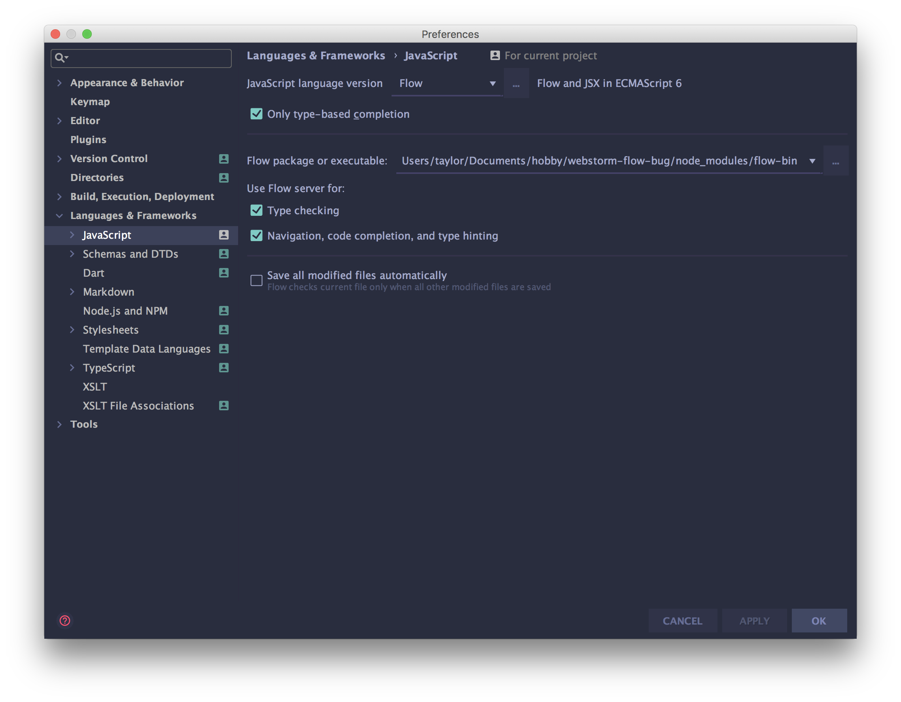
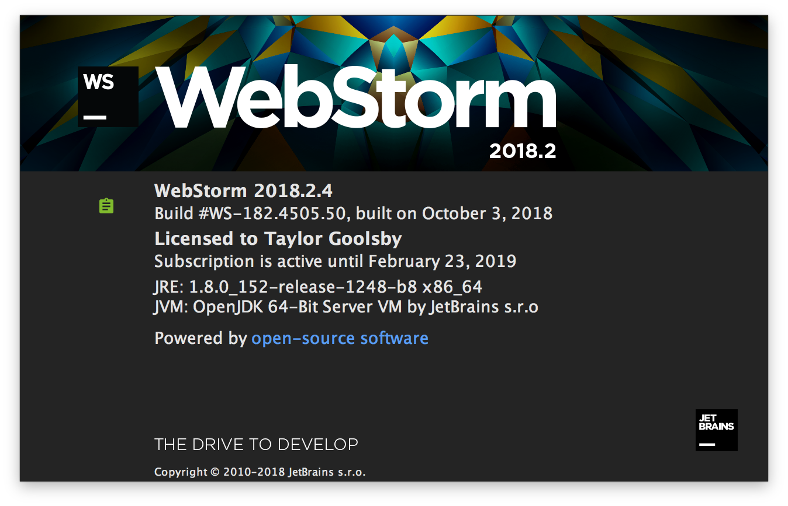

# Webstorm Flow Bug Demonstration

This is a bug where webstorm 2018.2.4 is unable to correctly display the inferred type from flowtype, yet `type-at-pos` is able to correctly display it. The type-info-on-hover feature works if the flow type is defined in the same file, but if the type is imported using `import type`, then the type-info-on-hover feature will wrongly infer the type is "any".

## Setup
1. Clone the repo.
2. Open in webstorm.
3. Run `yarn`. This will install `flow-bin` in `node_modules`.
4. Direct webstorm to use the flow-bin in node_modules:

5. Take a look at [src/index.js](src/index.js) for further bug details.

## WebStorm version this bug occurs on:

